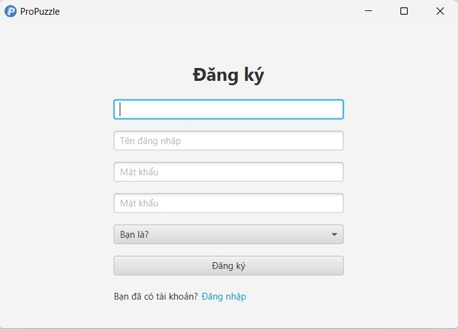

# [Ứng dụng câu đố: ProPuzzle]

**ProPuzzle** là một nền tảng luyện thi toàn diện, được thiết kế để hỗ trợ cả sinh viên và giảng viên trong quá trình ôn tập và giảng dạy. Với giao diện trực quan và đa dạng tính năng, **ProPuzzle** cho phép người dùng tham gia giải các bài tập, làm đề thi mô phỏng và xem lịch sử kết quả, giúp nâng cao kiến thức cũng như rèn luyện kỹ năng làm đề. Đồng thời, hệ thống quản trị mạnh mẽ cho phép giảng viên dễ dàng quản lý các câu hỏi, tạo đề thi và theo dõi hiệu quả học tập của sinh viên.

Dự án được thực hiện bởi [Phạm Mai Linh](https://github.com/tolalinhne), trong quá trình học Lập trình hướng đối tượng tại [ProPTIT](https://proptit.com/).


## Demo

[Link Video Demo](https://youtu.be/sJQdoMvyj64)


## Screenshots




## Features

**Ứng dụng có 1 admin quản lý chung, user được chia thành teacher và student.**

- **Admin** 
  + Xem tổng quan hoạt động (số lượng sinh viên, số lượng giảng viên, số lượng bài kiểm tra...).
  + Xóa user và đổi mật khẩu cho các user.
- **Teacher** 
  + Thêm, sửa, xóa các câu hỏi, bài luyện tập và bài kiểm tra.
  + Xem lịch sử làm bài của các bài kiểm tra và bài luyện tập mà giảng viên tạo ra.
  + Cập nhật thông tin cá nhân (họ và tên, ngày sinh, giới tính...).
- **Sinh viên** 
  + Tham gia làm các bài luyện tập và bài kiểm tra.
  + Xem lịch sử làm bài.
  + Cập nhật thông tin cá nhân (họ và tên, ngày sinh, giới tính...).

## Requirements

- [Java](https://www.java.com/en/) 

## Usage

Project Structure

```bash
ProPuzzle
├── out/artifacts/ProPuzzle_jar
│   │
│   ├── ProPuzzle.exe
│   │
├── src/main
│   ├── java
│   │     ├── Controller 
│   │     ├── Model
│   │     ├── Utils
│   ├── resources 
│   │     ├── Controller
│   │     ├── Image
│   ├── ... (các file cấu hình, JSON, ...)

```
## Installation

Cách cài đặt dự án

```bash
  - Clone dự án.
  - Mở dự án bằng IDE (IntelliJ, Eclipse, NetBeans).
  - Chạy ứng dụng:
    + Cách 1: Mở Main.java và chạy chương trình.
    + Cách 2: Mở ProDuelist.exe và chạy chương trình.
```
    

## License

[MIT](https://choosealicense.com/licenses/mit/)